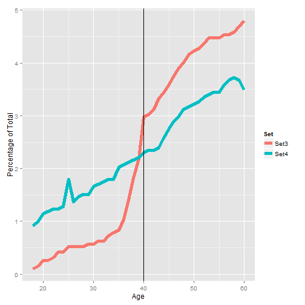

Data Product Presentation
========================================================
## Demographic Comparator Application

author: J.D. Anderson

date: 4/26/2015

Problem Statement
========================================================
As the amount of data sets our organization has collected increases, we are provided with many more options for advanced analytical analysis.

However, with more data sets comes more confusion as to which sets are available, and which are most appropriate for the specific analysis begin performed.

Solution
========================================================
### The New Demographic Comparator Shiny App!!!

This application will allow the analytics teams to easily:

1.  Browse the data sets to see which are available 
2.	View the demographic distribution for each set
3.	View the information for multiple sets simultaneously in order to compare and contrast their demographic information

The application will allow for the selection of data sets and specific Demographic values. Output from the current Set3 and Set4 sets with details for age 40 is shown on the next slide.

Example
========================================================

 

***
Set Totals
```
Set    Record Count
Set3   764003
Set4   2106088
```
Age Totals for Age 40
```
Set   Count  Pct
Set3  22693  2.9703
Set4  48327  2.2946
```

Summary
========================================================
### Conclusion

The new Demographic Comparator Shiny App will allow the analytics teams to more quickly identify the data sets that they need and spend more time on the analytics process.

### Next Steps

1.  The current metric collections that are performed when data sets are loaded will need to be upgraded to produce the input files required by the application
2.	A new local R Shiny server will need to be implemented in order to host the application


